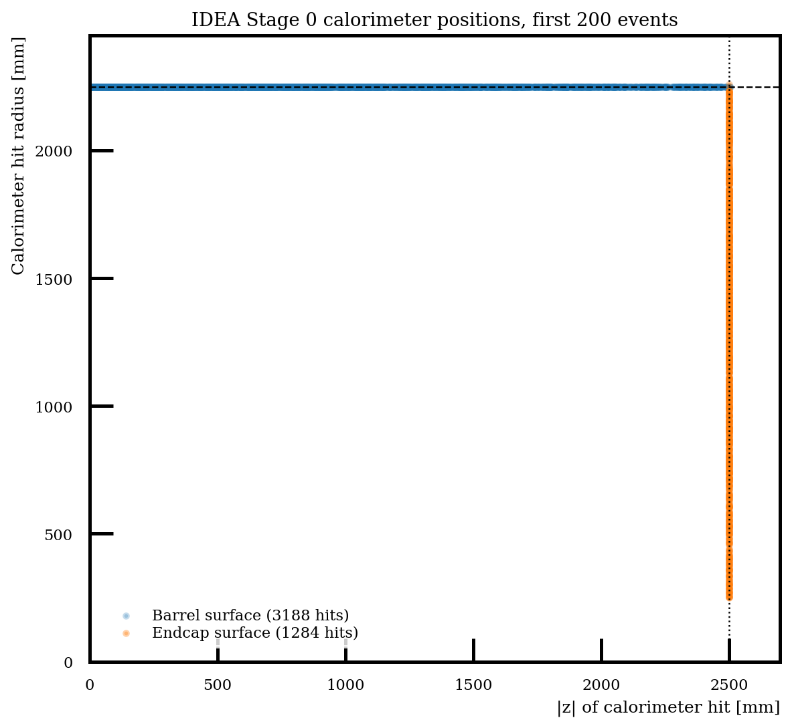
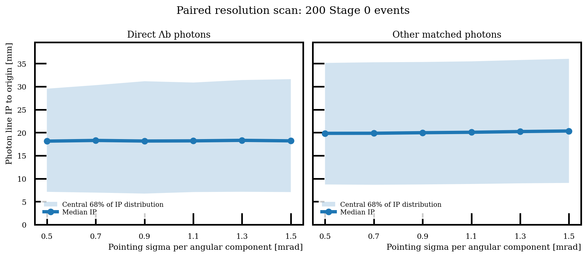

# Checkpoint: offline photon pointing after the v3 BDT

Date: 2026-10-05. This checkpoint freezes the procedure, implemented tools,
pilot evidence and remaining work. **Stage 1 must not be rerun.** The intended
application is an additional photon-displacement requirement on the existing
selected signal, Zbb, Zcc and Zss candidates.

## 1. What is complete

- Audited photon information in the existing Stage 0, Stage 1 and Stage 2 files.
- Measured the effective calorimeter surface from 200 existing Λη Physics
  Stage 0 events, with input/card hashes and a figure.
- Implemented a four-parameter barrel plus annular-endcap geometry and tested
  barrel/endcap intersections, beam-hole rejection, endcap gaps, zero smearing
  and a known 1 mrad rotation.
- Implemented synthetic photon directions, hypothetical momenta and photon
  line impact parameters under configurable angular-resolution hypotheses.
- Ran a separate 200-event Physics signal object pilot, followed by the
  requested six-point scan at **0.5, 0.7, 0.9, 1.1, 1.3 and 1.5 mrad**.
- Saved per-photon vectors/results, plots, numerical summaries and commands.

**Not yet performed:** joins for the post-BDT candidates across all four
samples; photon-cut efficiencies, scaled background rejection or a new FoM;
PHSP acceptance after a photon cut; or a Λ–γ vertex fit. The other-photon
category in the signal pilot is not a Zss background sample.

## 2. How the calorimeter shape was determined

The first 200 events of
`outputs/delphes/chunks/Lb2LambdaEtaPhysics_nev100000_chunk0_IDEA_edm4hep.root`
were read directly with uproot's synchronous `MemmapSource`. For every saved
`CalorimeterHits.position`, compute `r=sqrt(x²+y²)` and `|z|` in mm.
The most populated 10 mm-rounded bins identify the barrel radius and endcap
plane. A second check counts positions within 1 mm of either surface.

Of **4,472 hit records**, 3,188 are on the barrel and 1,286 on an endcap;
two are at the seam and satisfy both conditions. All records satisfy at
least one condition. The inferred surfaces match `R=2.25` and `HL=2.5`
(metres) in the IDEA card's propagation cylinder.

| Parameter | Value | Meaning |
|---|---:|---|
| Barrel radius R | 2,250 mm | Cylinder r=R |
| Endcap position Z | 2,500 mm | Planes z=±Z, also bounding the barrel |
| Endcap inner radius | 249.554 mm | Effective beam opening derived from |eta|≤3 |
| Endcap outer radius | 2,250 mm | Chosen to meet the barrel |

The inner radius is **derived from the card acceptance**, not estimated from
the smallest of 200-event hit radii: `r_inner=Z/sinh(eta_max)` with eta_max=3.
The active endcaps are annuli. The cylinder's nominal length is 5,000 mm.
This is the effective surface used by the fast simulation, without shower
depth or longitudinal segmentation.

All 4,052 `EFlowPhoton` objects in this geometry audit have zero position and
direction-error fields; the saved hit energies are also zero. The hit
positions establish geometry but do not constitute a measured shower axis.



Evidence: [geometry JSON](data/v3_photon_pointing_geometry_200events/geometry_audit.json),
[field audit](STAGE2_V3_PHOTON_POINTING_INPUT_AUDIT_2026-10-05.md),
[geometry reproduction command](../howto/v3_photon_pointing_geometry.md).

## 3. Existing tuple information and recovery

| Information | Existing location | Recovery required |
|---|---|---|
| Candidate/event identity, photon reco and MC indices, ancestry | Offline Stage 2 tables | Preserve sample/source/chunk, event_entry, candidate_slot and candidates_in_event |
| Reconstructed photon px,py,pz,E | Stage 1 `lb_photon_px/py/pz`, `lb_photon_energy` | Join the selected candidate to the existing Stage 1 output; the smaller Stage 2 table retains p,pT,eta,E but omits phi/components |
| Photon truth summaries | Stage 1 `reco_mc_p/energy/pt/eta`, `reco_mc_cos_opening`, `reco_mc_vertex_rxy` | Index with `lb_photon_index`; these summaries cannot recover the full truth direction |
| True photon px,py,pz and full production vertex | Stage 0 `Particle.momentum.x/y/z`, `Particle.vertex.x/y/z` | Join the saved matched MC index in the correctly identified original event |
| Fitted PV and Λ SV/momentum | Existing Stage 1 reconstruction | Copy these fields onto the same selected candidate for IP and later Λ–γ geometry |

Stage 1 does not retain the true photon azimuth/components, full truth vertex
or calorimeter hits. They cannot be reconstructed uniquely from the saved
scalar truth summaries. Reading original Stage 0 records to enrich selected
rows is an **I/O join**, not a rerun of generation or reconstruction.

For native Condor chunks, recover the exact original input-file order and
map chunk-local `event_entry` through cumulative input event counts. Validate
the mapping with the saved photon reco/MC indices, reconstructed momentum
and truth PDG before accepting a join. Do not assume that a chunk event index
is an entry in a single original file. Keep unmatched/nonunique associations
as explicitly counted categories; no apparent rejection can be credited to
a missing synthetic measurement.

## 4. Predicting the hit and emulating pointing

1. Normalize the **original reconstructed** photon momentum to u. Its current
   direction is treated as originating at (0,0,0).
2. Compute `t_barrel=R/sqrt(ux²+uy²)` and `t_endcap=Z/abs(uz)`, with infinity
   for zero denominators. The first crossing is `h=min(t_barrel,t_endcap)*u`.
   At an endcap crossing require `r_inner≤sqrt(hx²+hy²)≤r_outer`. Mark rays
   through the hole or a gap invalid; do not assign a later barrel crossing.
3. Normalize the matched **true** photon momentum to n_true. Construct two
   orthogonal unit axes in the plane perpendicular to n_true. Draw independent
   standard normals g1,g2 once per unique `(sample, source event, reco photon)`.
   Reused photons in several candidates must share the measurement.
4. At a requested sigma, form the tangent vector
   `delta=sigma*(g1*e1+g2*e2)` and its length a. The synthetic unit direction is
   `n=cos(a)*n_true + (sin(a)/a)*delta`, with the continuous a=0 limit.
   Sigma is in radians in the calculation. Each quoted resolution is a
   Gaussian **per tangent-plane component**, so small-angle radial RMS is
   sqrt(2)*sigma. Reuse g1,g2 across all six hypotheses for paired comparisons.
5. The hypothetical photon line is `h+t*n`. Its optional hypothetical
   massless momentum is `E_reco*n`, using the existing measured photon energy.
   Store these as extra fields, while retaining original mass, cos(theta_p),
   BDT score and pre-pointing selection for the additional-cut comparison.

The truth direction defines a synthetic detector response, not an unsmeared
selection variable. The truth production vertex is used for closure checks.
The current hit model inherits the reconstructed direction's position response;
it introduces no extra position smearing.

### Displacement information and the Zss hypothesis

The intended mechanism is that an origin-based reconstructed direction
locates a photon impact point, while the true momentum specifies the actual
flight direction from its possibly displaced production point. Keeping the
impact point fixed and replacing the direction with a smeared true direction
therefore creates a photon line that need not pass through the origin.
The pointing direction must not be reset to the vector from PV to that hit.
True momentum alone does not encode a vertex: the displacement is recovered
from the combination of the impact point and independently measured direction.

For an exact impact point `h_true=v_true+t*n_true`, zero angular smearing
must satisfy `(h_true-PV) cross n_true = (v_true-PV) cross n_true`.
The analytic displaced-photon test verifies this: a photon from (2,3,4) mm
travelling along +x has IP_3D=5 mm and IP_xy=3 mm; the origin-based direction
has zero IP, while the fixed-hit true direction recovers both nonzero values.
This check establishes the geometry logic. The existing reconstructed-hit
pilot separately measures the effect of an imperfect impact-position proxy.

The physics hypothesis is improved rejection of selected Zss relative to
signal if their photon-line displacement or Λ–γ compatibility distributions
differ sufficiently at the assumed resolution. Signal photons originate at
the Λb decay; the selected Zss photon composition and displacement must be
measured rather than assumed to be uniformly prompt. The current pilot
does not confirm or exclude improved Zss rejection, because it contains no
post-BDT Zss sample. Its impact-position limitation does not change this
intended mechanism.

## 5. Photon displacement variable

For the fitted PV v and predicted impact point h, define d=h-v. The model
computes two unsigned distances:

```
IP_3D = |d × n|
IP_xy = |dx*ny - dy*nx| / sqrt(nx² + ny²)
```

These are distances from the PV to the photon line. A single line does not
determine the photon's decay point along it. IP significance requires a
covariance model for impact position, direction and PV; it is not provided
by the current distance-only implementation. The 200-event pilot uses PV
(0,0,0) explicitly, whereas the intended post-selection study uses the saved
fitted PV. A later Λ–γ closest-approach calculation can combine this photon
line with the Λ line through its fitted SV, with special treatment of nearly
parallel lines and the corresponding uncertainties.

## 6. Pilot evidence and the material limitation

The separate first 200 Physics signal events contain 3,632 reconstructed
type-22 photons, of which 3,621 have unique stable MC-photon matches. Eleven
do not satisfy that association rule. All matched photons project onto the
active geometry. There are 200 direct Λb/anti-Λb photons and 3,421 others.
This is before Stage 1/BDT selection and has no projected physics yield.

For direct photons, the true-line median IP is **0.421 mm**. With the exact
true direction but the reconstructed-direction hit proxy, the zero-smearing
median is already **18.276 mm**. Across the six requested sigma values the
median ranges from **18.136 to 18.306 mm**. Thus the current impact-position
approximation dominates this pilot in the 0.5–1.5 mrad range. The IDEA card
uses `EtaPhiRes=0.02` and `SmearTowerCenter=true`.

This does not establish that 1 mrad pointing is intrinsically ineffective.
It establishes that the current predicted-hit response is a limiting
assumption. A different impact-position resolution or truth-projected ideal
hit would require its own named response scenario and paired comparison.
Do not silently interpret improved direction alone as improved position.



The band is the central 68% of the IP distribution, not uncertainty on the
median. [CSV](data/v3_photon_pointing_scan_0p5_1p5_200events/pointing_resolution_scan.csv),
[IP distribution overlays](data/v3_photon_pointing_scan_0p5_1p5_200events/pointing_pilot.png),
[frozen manifest](data/v3_photon_pointing_scan_0p5_1p5_200events/pointing_pilot.json),
[per-photon data](data/v3_photon_pointing_scan_0p5_1p5_200events/photon_pointing_pilot.parquet).

## 7. Applying it to the four selected samples

Use the existing Zbb-trained 1,091-chunk model and the frozen v3 scored
tables. Keep the two provisional baselines distinct:

- Armenteros rejection plus BDT score ≥0.9855620861.
- Armenteros rejection plus |lambda_d0_sig|≥5 plus BDT score ≥0.9810956120.

The Armenteros box rejects `0.67≤|alpha|≤0.78` and
`0.075≤qT≤0.120 GeV`. These two baselines have no added π0 or eta veto.
Other veto branches require their own named comparison. None of these
provisional points is relabelled as a PI-adopted selection by this checkpoint.

For each baseline and each of signal/Zbb/Zcc/Zss:

1. Preserve every surviving candidate and all original keys, labels, score
   and weights. Freeze its counts before pointing.
2. Enrich those rows from existing Stage 1/Stage 0 as above, validate joins,
   and report matched, unresolved and outside-aperture counts separately.
3. Generate one consistent synthetic photon measurement per unique photon
   at each of the six resolutions. Apply the same proposed reconstructed
   IP threshold to every sample. First inspect distributions; do not assume
   that a particular threshold or direction of cut is optimal.
4. Show raw candidate counts and distinct event counts. Report conditional
   retention relative to the pre-pointing selected sample, and cumulative
   acceptance using the unchanged generated/processed denominator. Count
   true signal and wrong signal combinations separately using labels only
   after selection.
5. Plot mass and cos(theta_p) before/after pointing and as linear physically
   weighted stacks. Optimize any cut on validation; preserve test partitions
   for checking the fixed choice and report sparse-tail counting intervals.
6. Recompute the PHSP acceptance versus generated cos(theta_p), migration
   and resolution for each proposed final selection before using it in a fit.

Physical scale remains the current named 6e12-Z scenario:

```
S   = (6e12)(0.15)(2)(0.10)(7.1e-6)(0.639) * N_signal_pass / N_generated_direct
Bbb = (6e12)(0.15)   * N_bb_pass / N_bb_processed
Bcc = (6e12)(0.1203) * N_cc_pass / N_cc_processed
Bss = (6e12)(0.156)  * N_ss_pass / N_ss_processed
FoM = S / sqrt(S + Bbb + Bcc + Bss)
```

The FoM uses counts in the **5.4–5.9 GeV signal peak**. Full-archive
denominators are 100,002 generated direct Physics signal decays,
395,623,929 Zbb, 499,786,495 Zcc and 499,842,440 Zss processed events;
validation/test each use their own frozen denominator. Zss does not cover
Zdd. Forced Λeta/Λpi0 and wrong signal combinations retain their separate
accounting to avoid double counting or silently changing the objective.
See the [frozen score review](STAGE2_V3_THREE_FLAVOUR_SCORE_REOPTIMIZATION_2026-10-04.md)
and [its command guide](../howto/v3_three_flavour_score_reoptimization.md).

## 8. Resume instructions and artifacts

- Geometry audit: `studies/resolutions/audit_calorimeter_geometry.py`.
- Geometry/smearing/IP functions: `studies/resolutions/photon_pointing.py`.
- Analytic checks: `studies/resolutions/test_photon_pointing.py` (five checks, including displaced-photon closure).
- Object pilot: `studies/resolutions/run_photon_pointing_pilot.py`.
- Requested scan config: `config/photon_pointing_scan_0p5_1p5_v3.json`.
- Broad pilot/control config: `config/photon_pointing_idealized_v3.json`.
- Exact reproducible commands: [howto/v3_photon_pointing_geometry.md](../howto/v3_photon_pointing_geometry.md).

On resumption, start with a small validated selected-candidate join from the
existing files, then resolve the hit-position response assumption using the
paired zero-smearing control. The inclusive chunk-to-original-file mapping
and matched-photon availability must be demonstrated before a four-sample
rejection scan. Keep processing bounded by selected source chunks and project
only necessary columns; use independent shard workers once the join is
validated. **Do not launch a new Stage 1 production.**

## Superseding handoff: v4 tuple extension (2026-10-05)

The PI subsequently requested a v4 Stage 1 reprocessing with all offline
pointing inputs retained. The earlier no-reprocessing constraint in this
checkpoint describes the v3 investigation. The current route is documented
in [the v4 howto](../howto/stage1_v4_photon_pointing.md): save true photon
production vertex/momentum, both predicted hit anchors, measured energy and
momentum, PV and geometry metadata; apply resolution hypotheses offline.
