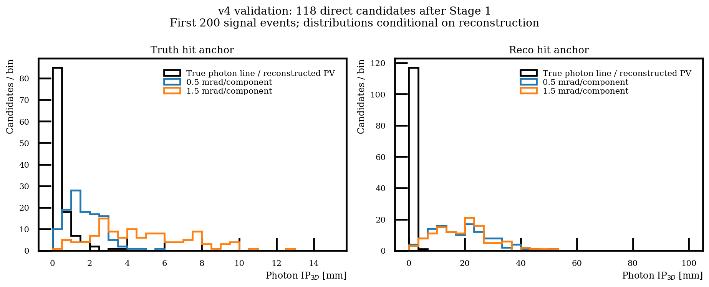

# v4 photon pointing tuple handoff — 2026-10-05

**Question:** can the PI reprocess once, then investigate calorimeter pointing
after Stage 2/BDT without retrieving the original EDM4hep files again?

**Implemented:** an opt-in v4 entry point attaches 28 photon diagnostic vectors
after reconstructed candidate building. It stores true momentum and production
vertex, the true-ray hit on the effective IDEA cylinder/endcaps, the alternative
origin/reconstructed-direction hit, PV and geometry parameters. Existing photon
energy and Cartesian momentum survive Stage 2, alongside Lambda momentum/SV.
All six angular hypotheses (0.5–1.5 mrad in 0.2 mrad steps) are generated offline.
No random smearing enters Stage 1. Each reused photon receives a consistent,
reproducible draw. Inputs for nonmatched photons are explicitly unresolved.

**Comparison:** first 200 events of the existing Physics signal input, with the
same v3 selection and observable configs. Exact commands, hashes, input and
software revisions are in the [manifest](data/stage1_v4_pointing_validation/manifest.json)
and [validation](data/stage1_v4_pointing_validation/validation.json).

| Check | Result |
|---|---:|
| Input events, each run | 200 |
| Candidate-bearing events | 121 |
| Stage 1 candidate rows | 133 |
| Direct truth-matched candidates / wrong combinations | 118 / 15 |
| Original branches identical between v3 and v4 | 474 / 474 |
| New candidate vectors with correct lengths | 28 / 28 |
| Matched photons / valid truth-ray hits | 133 / 133 |
| Stage 2 audit / selected rows retaining fields | 133 / 129 |
| Rows after frozen BDT score ≥ 0.9855620861, retaining fields | 46 |

The BDT count is a handoff check on this small signal pilot, with no additional
Armenteros or veto cut. It is not a new efficiency or optimized selection.
The validator checks identical values of all old branches, geometric closure,
surface membership, downstream retention and random draws under row reversal.
Additional tests cover barrel/endcap/hole/seam/outside rays, invalid directions,
reused photons, unresolved matches and processing a row in a separate batch.
The native Condor worker configuration imports successfully with all 502 output
branches; a complete inclusive campaign has not been launched or validated.

## Results and figure

- [Paired validation and counts](data/stage1_v4_pointing_validation/validation.json).
- [Required Stage 1 branch validation](data/stage1_v4_pointing_validation/branch_validation.json).
- [Frozen Stage 1 audit table](data/stage1_v4_pointing_validation/signal_stage1_audit_v4.parquet).
- [Frozen post-BDT pointing table](data/stage1_v4_pointing_validation/signal_post_bdt_pointing_v4.parquet).
- [Pilot hit-anchor comparison figure](figures/stage1_v4_pointing_validation.png), reproduced using [the howto](../howto/stage1_v4_photon_pointing.md).

The plot uses the 118 direct signal candidates after Stage 1. The ideal truth-hit
scenario responds to angular resolution; the reconstructed-hit scenario also
contains the existing position uncertainty. Each panel has its own horizontal
range and bin width. These are conditional pilot shapes, not expected yields.

**Assumptions and limitations:** truth-hit anchoring assumes ideal hit position;
the alternative inherits position smearing from the current reconstructed
photon direction. Neither is a complete pointing-calorimeter response model.
The inner endcap radius is inferred from |eta|≤3, and the surface is effective.
All matches in this signal pilot are valid; inclusive samples must separately
report unresolved fractions and may not count unresolved photons as rejected.
This check makes no claim yet about Zss suppression or a photon–Lambda vertex
fit. The stored displacement is a distance, not an uncertainty-normalized
significance. Signal acceptance must be reevaluated for any adopted new cut.

**PI handoff:** use the [v4 direct and Condor commands](../howto/stage1_v4_photon_pointing.md)
for signal/PHSP, Zbb, Zcc and Zss in fresh campaigns, catalog each campaign, then
compare pointing-cut efficiencies and mass/angle distributions after the fixed
BDT selection. The PI chooses the detector hypothesis and any reference cut.
