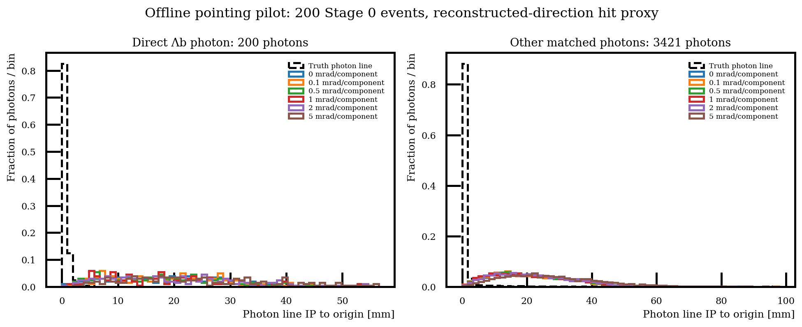

# Offline photon pointing model and 200-event response pilot

## Question and geometry

Can an effective calorimeter surface, reconstructed photon momentum and true
photon direction support an offline pointing-resolution comparison without
rerunning Stage 1? The implementation and pilot below answer that input and
geometry question; they do not yet estimate post-BDT Zss rejection.

The [scenario config](../config/photon_pointing_idealized_v3.json) exposes:

| Parameter | Value | Basis |
|---|---:|---|
| Barrel radius | 2,250 mm | Existing hit audit and IDEA propagation cylinder |
| Endcap absolute z | 2,500 mm | Existing hit audit and IDEA propagation cylinder |
| Endcap inner radius | 249.554 mm | Effective aperture from eta_max=3: z/sinh(3) |
| Endcap outer radius | 2,250 mm | Chosen to meet the barrel |

The card has no separate ECAL inner-radius setting. Its photon acceptance
and calorimeter binning extend to |eta|=3, which gives the effective annular
opening at the endcap plane. This is a fast-simulation surface approximation,
not a measured shower depth or a detailed engineering geometry. Rays through
the beam hole or outside an annular endcap are flagged; they are not silently
projected onto the barrel beyond its physical z extent.

## Implemented measurement

For a reconstructed photon unit direction u, set
`t_barrel = R/sqrt(ux²+uy²)` and `t_endcap = Z/abs(uz)`.
The first crossing is at `h = min(t_barrel,t_endcap)*u`, subject to the
endcap aperture. The current origin assumption is (0,0,0).

Smear the true direction by two independent Gaussian angular components in
its local tangent plane. The configured hypotheses are **0, 0.1, 0.5, 1, 2
and 5 mrad per component**; their small-angle radial RMS is sqrt(2) times
that number. The same standard-normal draws are reused across hypotheses
and each unique photon receives one draw. The resulting unit direction n
and measured energy define a hypothetical massless momentum `p = E_reco*n`.
These momenta are saved as additional diagnostic fields.

The photon line is `h + t*n`. Its 3D impact parameter to a PV is
`|(h-PV) cross n|`; the transverse impact parameter is
`|(hx-PVx)*ny - (hy-PVy)*nx|/sqrt(nx²+ny²)`.
These are distances to a line, not the decay distance along that line.
They are not significances; a covariance model is still needed for that.
For later selected candidates the existing fitted PV will be used. The
current object pilot explicitly fixes PV to the origin.

The hit proxy inherits the current reconstructed direction's granularity and
smearing. No additional position smearing is added. Exact truth directions
are used only to create synthetic measurements and truth-response controls.
Neither BDT inputs nor existing selections were changed or rerun.

## Pilot inputs and results

Input: first **200 events** of the existing
`Lb2LambdaGammaPhysics_nev100000_IDEA_edm4hep.root` under the recorded EOS
production path. The [frozen JSON](data/v3_photon_pointing_200events/pointing_pilot.json)
records the exact path, input/config/script hashes, seed, command, event limit,
and all quantiles. The pilot contains 3,632 reconstructed type-22 photons:
3,621 have a unique stable MC-photon association and 11 do not meet that
association rule. All 3,621 matched photons project onto the active surface.
Among them, 200 are directly from a Λb or anti-Λb and 3,421 are other photons.
This is an object diagnostic before Stage 1/BDT selection. The other photons
are in the forced signal sample; they are **not a Zss sample**. Unmatched
objects must be accounted for in any later background-rejection estimate.

| Per-component angular sigma | Median IP of 200 direct Λb photons [mm] | Median IP of 3,421 other matched photons [mm] |
|---|---:|---:|
| True photon line (true vertex and direction) | 0.421 | 0.283 |
| 0 mrad, reconstructed-direction hit proxy | 18.276 | 19.787 |
| 0.1 mrad | 18.106 | 19.778 |
| 0.5 mrad | 18.136 | 19.831 |
| 1 mrad | 18.117 | 20.057 |
| 2 mrad | 17.843 | 21.018 |
| 5 mrad | 21.581 | 25.747 |

Finite-sample medians need not increase monotonically with smearing. The
zero-smearing control is the main finding: pairing the exact truth direction
with a hit predicted from the existing reconstructed direction already
produces an approximately 18 mm median IP for direct photons. The position
approximation and its inherited response dominate this pilot at 1 mrad.
The present card's `EtaPhiRes=0.02` and `SmearTowerCenter=true` are relevant
to this limitation. A realistic high-precision pointing study needs a stated
impact-position resolution in addition to its angular resolution. An ideal
truth-derived impact position with an explicit position response would be a
different named scenario, rather than silently replacing this proxy.

Next, recover the selected photons' full MC momentum through validated joins
to the existing Stage 0 inputs, retaining source/chunk identity and all
unmatched candidates in the accounting. Compare the position-response
assumptions before interpreting any Zss or signal cut efficiency. No Stage 1
rerun is required by the current offline study.

## Applying this after Stage 2 and the BDT

Apply the extra pointing requirement to the same candidates surviving the
fixed BDT and named Armenteros/Λ-IP/veto scenario. Join photon reconstructed
indices and matched MC indices using the full source/event/candidate keys.
Existing Stage 1 supplies reconstructed vectors and fitted PV; existing
Stage 0 supplies the matched true direction. Attach hypothetical photon-line
observables as new columns. Preserve the original candidate mass, BDT score
and selection when measuring this additional cut.

Report retention relative to the pre-pointing selected candidates and total
acceptance relative to the original generated/processed denominators, using
the existing independent Zbb/Zcc/Zss branching weights. Recompute PHSP angular
acceptance for any proposed final pointing cut. Missing truth associations
are an unresolved response category, not automatically rejected background.
The pilot above has not yet performed those post-BDT joins or rejection scans.

## Results and reproduction

- [Six-point 0.5–1.5 mrad scan](data/v3_photon_pointing_scan_0p5_1p5_200events/pointing_resolution_scan.png), [IP distributions](data/v3_photon_pointing_scan_0p5_1p5_200events/pointing_pilot.png), [CSV](data/v3_photon_pointing_scan_0p5_1p5_200events/pointing_resolution_scan.csv) and [frozen configuration/provenance](data/v3_photon_pointing_scan_0p5_1p5_200events/pointing_pilot.json).
- [Displacement comparison figure](data/v3_photon_pointing_200events/pointing_pilot.png)
- [Numerical summary and provenance](data/v3_photon_pointing_200events/pointing_pilot.json)
- [Per-photon vectors, predicted hits and impact parameters](data/v3_photon_pointing_200events/photon_pointing_pilot.parquet)
- [Commands and analytic checks](../howto/v3_photon_pointing_geometry.md#pointing-resolution-pilot)
- [Reusable geometry and pointing implementation](../studies/resolutions/photon_pointing.py)

## Six-point differential resolution scan

The named config `photon_pointing_scan_0p5_1p5_v3.json` uses six equally spaced
values: **0.5, 0.7, 0.9, 1.1, 1.3 and 1.5 mrad per tangent-plane component**.
The same 200 events, hit proxy, geometry, photons and seed are used at every
point. This pairs the stochastic fluctuations across the hypotheses. The
original broad-resolution pilot is retained separately.

| Sigma [mrad/component] | Direct-photon median IP [mm] | Other matched-photon median IP [mm] |
|---|---:|---:|
| 0.5 | 18.136 | 19.831 |
| 0.7 | 18.285 | 19.847 |
| 0.9 | 18.159 | 19.966 |
| 1.1 | 18.197 | 20.060 |
| 1.3 | 18.306 | 20.218 |
| 1.5 | 18.197 | 20.340 |

The plot's shaded interval is the 16th–84th percentile of the photon IP
distribution, **not an uncertainty on its median**. The variation over this
range remains small compared with the displacement caused by the current hit
proxy. These are the same pre-Stage-1 object diagnostics; the post-BDT
signal/Zbb/Zcc/Zss comparison still needs the source joins described above.

