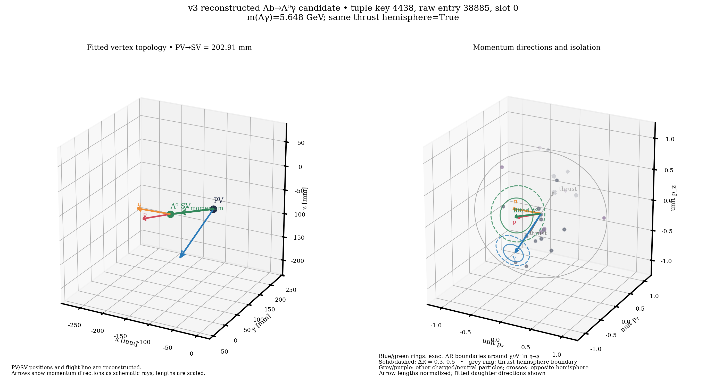

# One-event v3 candidate geometry display

This is a single reconstructed Physics-signal event for explaining candidate
assembly, decay topology, and isolation. It is **not** an efficiency,
background, or cut study.
The candidate is chosen as tuple row 0, slot 0, without using MC truth. Its
saved truth label is 1 and is annotation only. The candidate mass is
5.648 GeV; the original event contains 28 reconstructed particles.



[Second camera view](../docs/figures/v3_candidate_event_display/candidate_3d_view_b.png) ·
[exact vectors, cone counts and source identities](../docs/figures/v3_candidate_event_display/event_display.json)

The left panel shows the fitted primary vertex (PV) and Λ⁰ secondary vertex
(SV) in **mm**. Their connecting line is the measured flight vector, 202.91 mm
for this event. The red and orange arrows start at the SV and show the fitted
proton and pion momentum directions. The green Λ⁰ momentum and blue selected
photon start at the PV. These arrows are straight, scaled schematic rays;
the plot does not claim to show complete charged-track trajectories or a
measured photon origin. The PV/SV points and flight line use fitted positions.

The right panel shows directions in unit-momentum space. Grey and purple
marks are other charged and neutral reconstructed particles; crosses are in
the opposite thrust hemisphere. The grey great circle is the plane
perpendicular to the **full-event** thrust axis. Arrow lengths are normalized;
the JSON gives measured momenta in GeV and fitted PV/SV coordinates in mm.

The blue and green rings are exact constant-ΔR boundaries around the photon
and fitted Λ⁰, respectively, for radii 0.3 (solid) and 0.5 (dashed). They
are made in η–φ and mapped onto unit 3D directions. A fixed ΔR boundary is
not a fixed 3D opening-angle cone. Stage 1 counts activity only on the fitted
Λ⁰ thrust side, with finite momentum/energy and strict `ΔR < radius`, after
excluding the candidate proton, pion, and photon. The saved Stage 1 counts
and counts recalculated from the original event agree in all twelve checked
fields. For this event, the photon-centered R0.3/R0.5 cones contain 0/1
other objects; the Λ⁰-centered cones contain 1/5. All are charged here.

## Reproduce

The exact inputs are the existing 100,000-event v3 Physics Stage 1 tuple
`/eos/lhcb/lbdt3/user/rquaglia/fcc_ee/lblgamma/outputs/stage1_v3_my_run/signal_physics.root`
and its logged EDM4hep input
`/eos/lhcb/lbdt3/user/rquaglia/fcc_ee/lblgamma/outputs/Lb2LambdaGammaPhysics_nev100000_IDEA_edm4hep.root`.
The Stage 1 log is alongside the tuple. Reconstruction used
`config/lb_reco_preselection_15mev_45_65_3d.json`; isolation radii are in
`config/lb_observables.json`. This command reads one tuple row and searches
the raw input for its photon when resolving the original event; it does not
run new detector simulation or reconstruction.

```bash
env -u PYTHONPATH -u PYTHONHOME myenv/bin/python \
  studies/reconstruction/plot_v3_candidate_event_3d.py \
  --stage1 /eos/lhcb/lbdt3/user/rquaglia/fcc_ee/lblgamma/outputs/stage1_v3_my_run/signal_physics.root \
  --edm4hep /eos/lhcb/lbdt3/user/rquaglia/fcc_ee/lblgamma/outputs/Lb2LambdaGammaPhysics_nev100000_IDEA_edm4hep.root \
  --tuple-row 0 --candidate-slot 0 --resolve-source-entry \
  --output-dir outputs/analysis/studies/v3_candidate_event_display_20261003
```

For this tuple, `event_entry=4438` does **not** locate the matching photon
in the raw file. The unique exact photon momentum and reconstructed-particle
index match is raw entry `38885`. Both identifiers are in the plot title and
JSON. This discrepancy needs a separate provenance audit before using
`event_entry` to join this multi-thread Stage 1 tuple to raw EDM4hep events.
The displayed raw event is accepted only after the selected photon matches
and the recalculated cone counts equal the stored Stage 1 values. New displays
should retain these checks, especially for other samples or tuple revisions.

For the full implementation of the activity sums, including all six radii
and the legacy ratio variables, see [understand_isolation.md](understand_isolation.md).

## PI review note

**Question:** Does one real v3 event make the candidate and cone definitions
inspectable? **Assumption:** The uniquely matched raw photon identifies the
same reconstructed event despite the tuple-key discrepancy. **Comparison:**
For one tuple candidate, recompute the twelve R0.3/R0.5 charged, neutral,
and all-object cone counts from the raw event and compare them to the saved
Stage 1 branches; compare the plotted PV–SV distance to the saved flight
length. **Observed:** 12/12 counts agree, the selected photon matches its raw
momentum and reconstructed-particle index, and the plotted flight length
agrees with Stage 1. **Limit:** One
event cannot validate event-key mapping or the full distribution of cone
values. **Next:** Audit the Stage 1 event-entry mapping on a representative
set of events before using raw-event joins in later studies. No selection or
detector choice changes from this figure.
